<div align="center">

# 🧵 Sutradhar
### Offline AI for Bitcoin transaction traffic: find the IP behind the wallet

**Given network sightings and blockchain data, Sutradhar tells an investigator which IP most likely broadcast a transaction, which wallets belong to one operator, and why, with the evidence for every claim.**

[](https://sutradhar-one-red.vercel.app)
[](https://sutradhar-btc-api.onrender.com/api/docs)

[](https://github.com/Abhishek222983101/sutradhar-btc/actions)
[](#-proved-offline)
[](https://python.org)
[](https://react.dev)

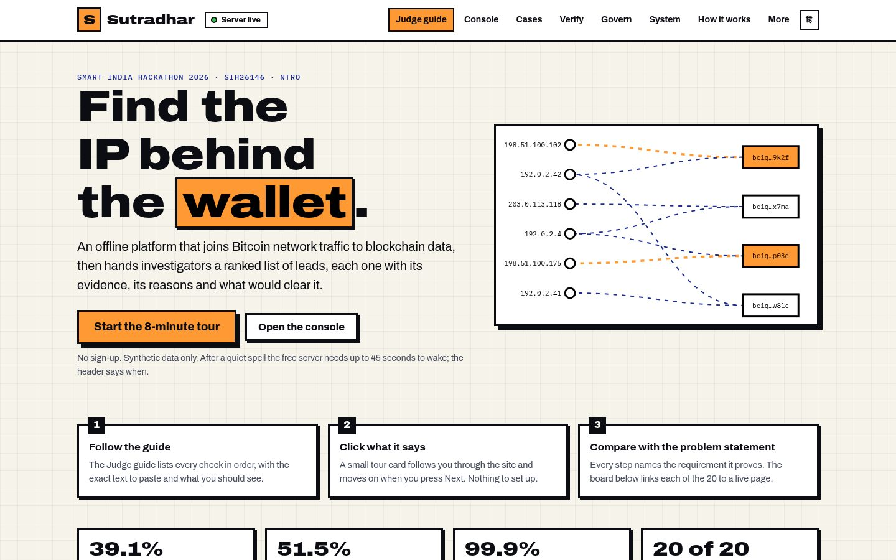

</div>

<div align="center">

## ▶️ [Watch the demo video on YouTube](https://youtu.be/5qLpwDIZ7bU)

[](https://youtu.be/5qLpwDIZ7bU)

**The whole project in under 5 minutes, then try it yourself on the [live site](https://sutradhar-one-red.vercel.app).**

</div>

---

## 🧑‍⚖️ Judges: start here (2 minutes)

| | |
|---|---|
| **0. Watch** | The [**demo video**](https://youtu.be/5qLpwDIZ7bU) (under 5 minutes). |
| **1. Open** | **https://sutradhar-one-red.vercel.app** and press **Start the 8-minute tour**. |
| **2. Follow** | The **Judge guide** (`#/guide`) lists every check in order: the exact text to paste, what you should see, and which requirement it proves. A small tour card follows you through the site. |
| **3. Compare** | Each of the 20 problem-statement requirements is linked from the landing page to a live page that proves it. |
| **Server asleep?** | The demo API is on a free host that sleeps when idle. It is pinged every 4 minutes by a keep-alive workflow, and if it is ever asleep a clearly labelled saved copy of the demo data shows instantly while it wakes (about 45 s). Upload, Cases and Verify need the live server. |
| **Video script** | The script behind the video is [`docs/DEMO_SCRIPT.md`](docs/DEMO_SCRIPT.md). |

<div align="center"></div>

---

## 📋 At a glance

| | |
|---|---|
| **Problem Statement** | PS 26146: *AI-Powered Monitoring & Analysis of Bitcoin Transaction Traffic* |
| **Organisation** | National Technical Research Organisation (NTRO) |
| **Theme / Category** | Blockchain & Cybersecurity / Software |
| **Dataset** | Synthetic, generated in-house (the PS provides none). Hidden ground truth is used only to grade the system. |
| **What is here** | A data generator, a 21-stage analysis engine, four trained models plus an anomaly detector, an API, a web console, an offline installer, tests and CI. Not a mock-up. |
| **Team** | Team Paradigm |

## 💡 The idea, in 20 seconds

Bitcoin addresses are pseudonymous, but the network is not. The node that first announces a transaction leaves a timing
trace at any listening sensor. Sutradhar joins two worlds: **network sightings** (who announced what, when) and **ledger
data** (which addresses moved which coins). It scores every candidate origin IP, groups addresses into wallets, spreads
risk from known bad wallets, and returns a **ranked list of leads**, each with a calibrated score, plain-language reasons,
the evidence against it, and a what-if.

---

## 🖼️ See it working

<table>
<tr>
<td width="50%" valign="top"><a href="https://sutradhar-one-red.vercel.app/#/console?lead=bc1q5frsvq&tab=why">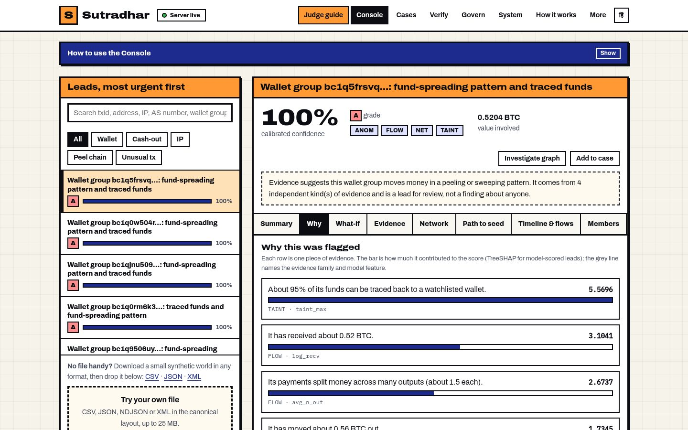</a><br><b>Explainable leads.</b> Every flag shows its evidence as weighted bars (exact TreeSHAP from a trained model), the evidence against it, and a what-if.</td>
<td width="50%" valign="top"><a href="https://sutradhar-one-red.vercel.app/#/console?lead=bc1q5frsvq&tab=network">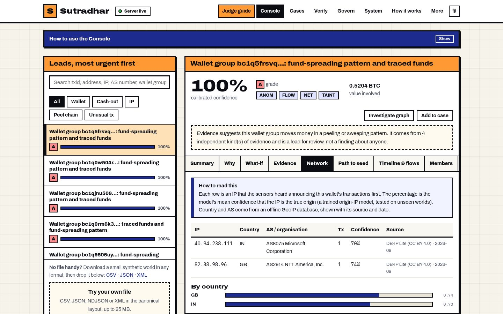</a><br><b>The IP behind the wallet.</b> Candidate origin IPs with probabilities, country and AS from an offline GeoIP database, and a propagation replay.</td>
</tr>
<tr>
<td width="50%" valign="top"><a href="https://sutradhar-one-red.vercel.app/#/console?lead=bc1q9506uy&tab=path">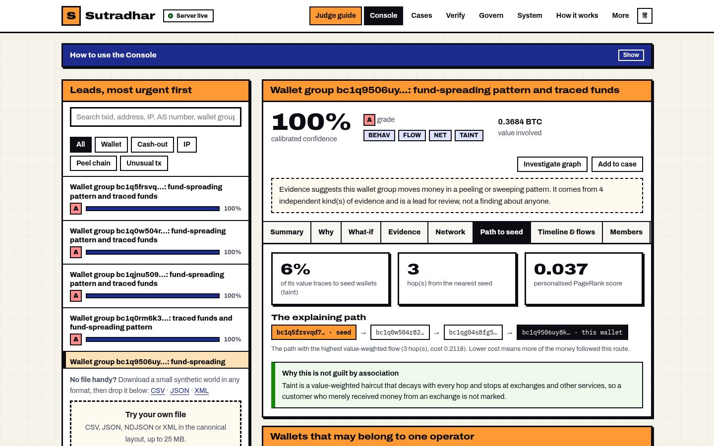</a><br><b>Risk propagation.</b> Taint and PageRank from watchlist seed wallets, with the explaining path drawn hop by hop.</td>
<td width="50%" valign="top"><a href="https://sutradhar-one-red.vercel.app/#/console?lead=bc1q5frsvq&tab=evidence">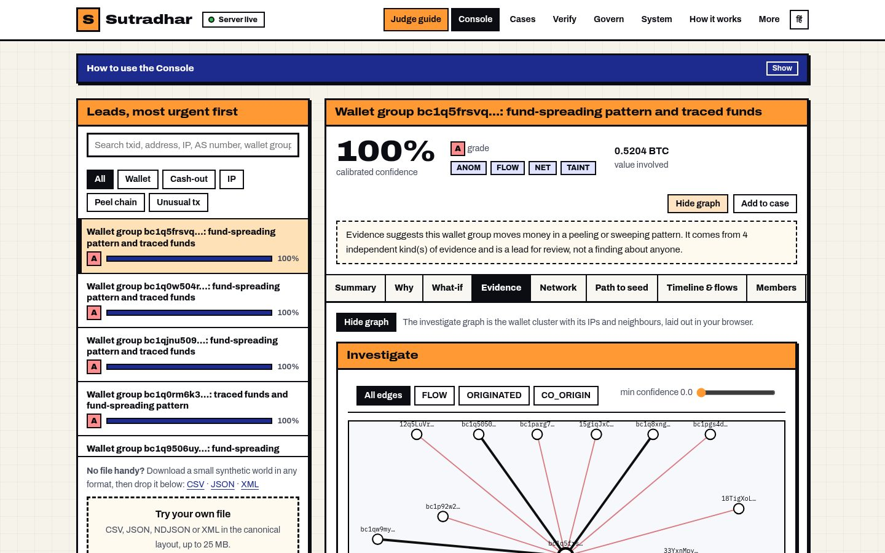</a><br><b>Link analysis.</b> Wallet cluster, IPs and neighbours, coloured by relationship: value flow, origin, co-origin, taint path.</td>
</tr>
<tr>
<td width="50%" valign="top"><a href="https://sutradhar-one-red.vercel.app/#/console?open=ip:40.94.238.111">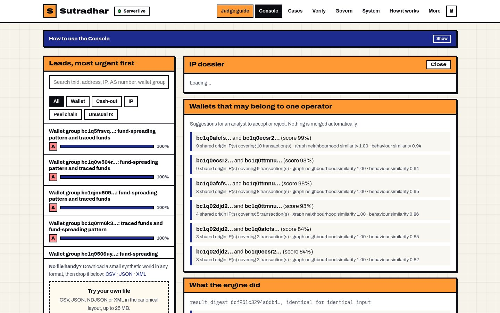</a><br><b>Dossiers.</b> Search any IP, AS, address, transaction or wallet and get one page with everything known about it.</td>
<td width="50%" valign="top"><a href="https://sutradhar-one-red.vercel.app/#/verify">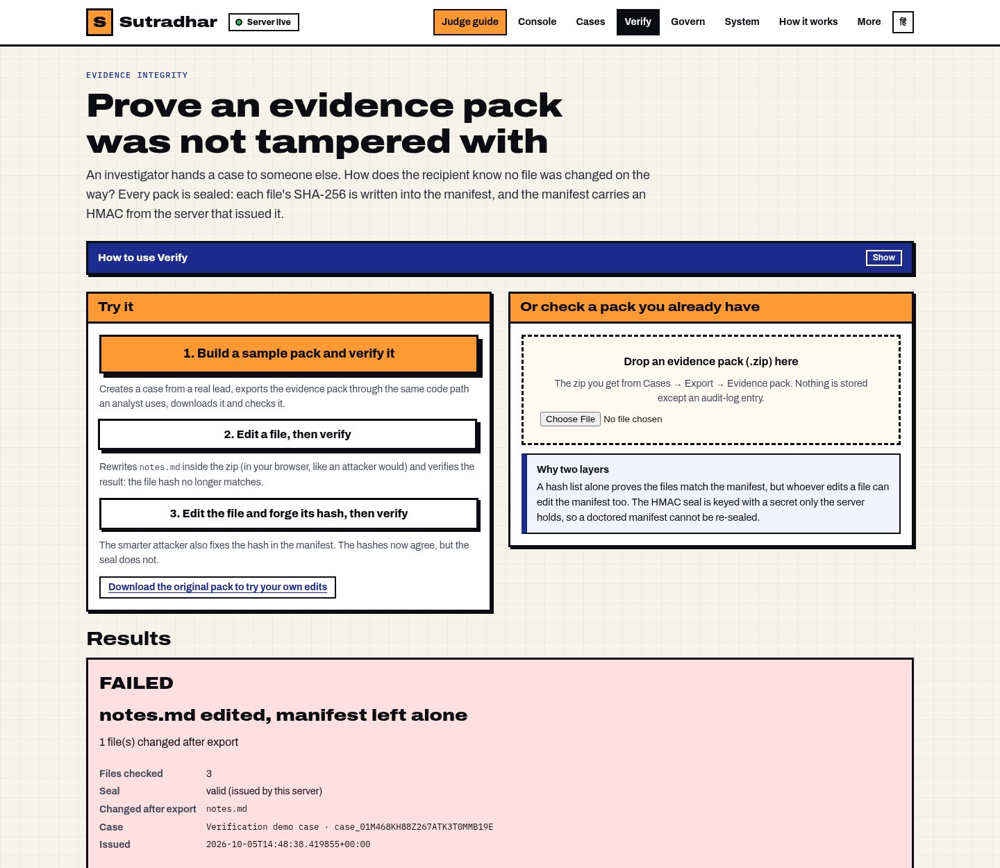</a><br><b>Tamper-evident evidence.</b> Every file in a case export is hashed and the manifest is HMAC-sealed. Edit a file, or forge its hash, and the check fails and says why.</td>
</tr>
<tr>
<td width="50%" valign="top"><a href="https://sutradhar-one-red.vercel.app/#/system">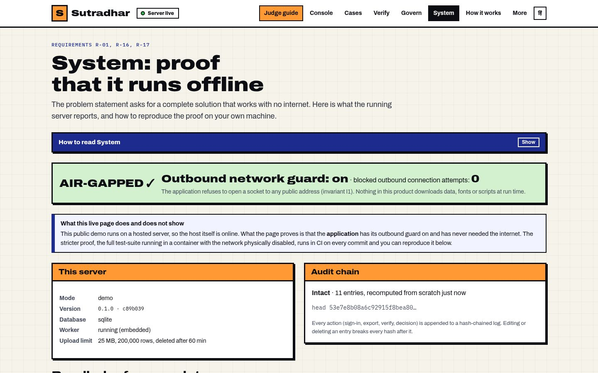</a><br><b>Offline, provably.</b> Outbound guard status, bundled reference data with checksums, the hash-chained audit log, and the commands to reproduce the proof.</td>
<td width="50%" valign="top"><a href="https://sutradhar-one-red.vercel.app/#/console">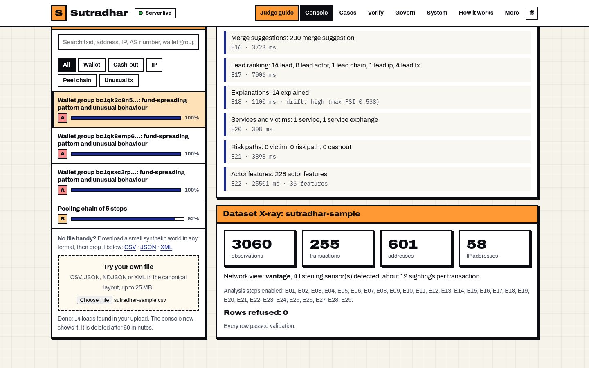</a><br><b>Bring your own data.</b> CSV, JSON, NDJSON or XML in, validated, analysed, with a dataset X-ray and a rejects report. Sample files are one click away.</td>
</tr>
<tr>
<td width="50%" valign="top"><a href="https://sutradhar-one-red.vercel.app/#/cases">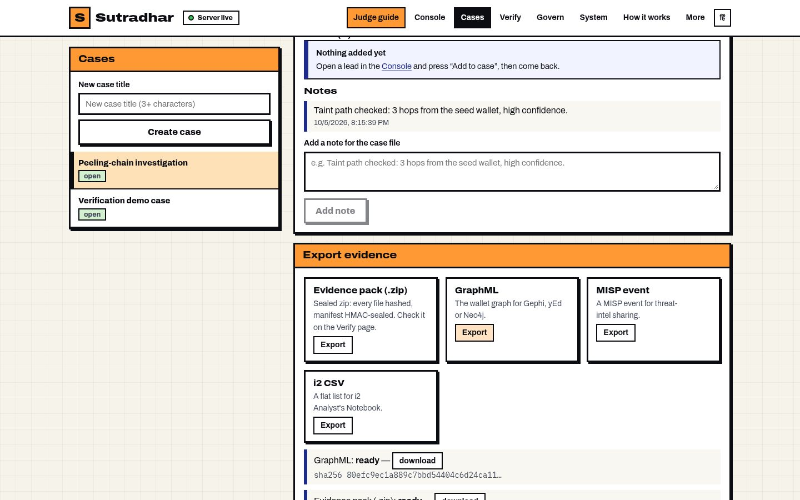</a><br><b>Case hand-off.</b> Notes plus four exports: sealed evidence pack, GraphML, MISP event, i2 CSV.</td>
<td width="50%" valign="top"><a href="https://sutradhar-one-red.vercel.app/#/how-it-works">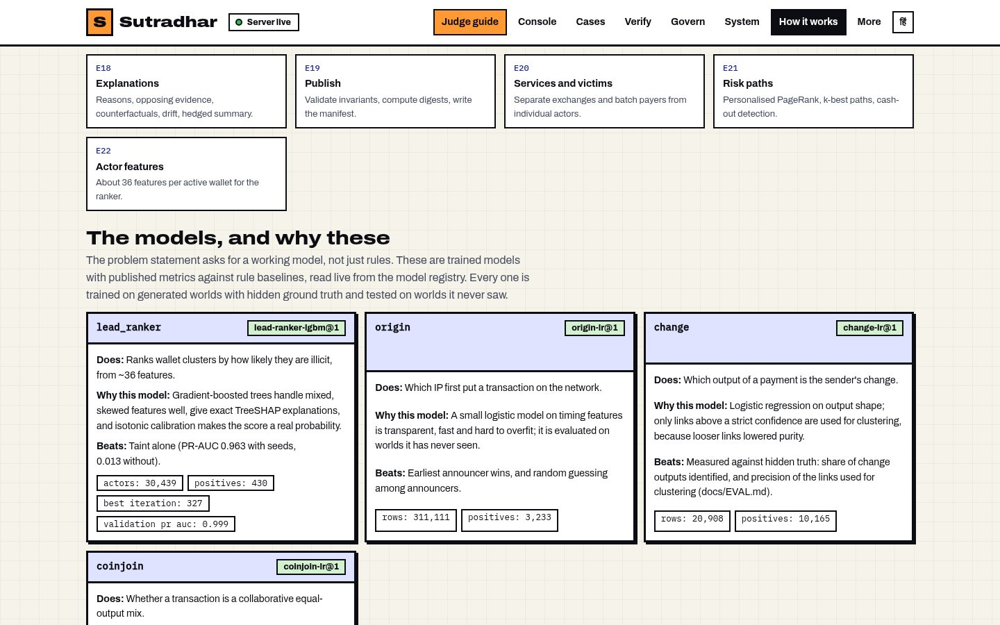</a><br><b>Real models, with metrics.</b> Four trained models and an anomaly detector, each shown with its score against a plain rule.</td>
</tr>
</table>

<details>
<summary>📱 It works on a phone too</summary>
<div align="center">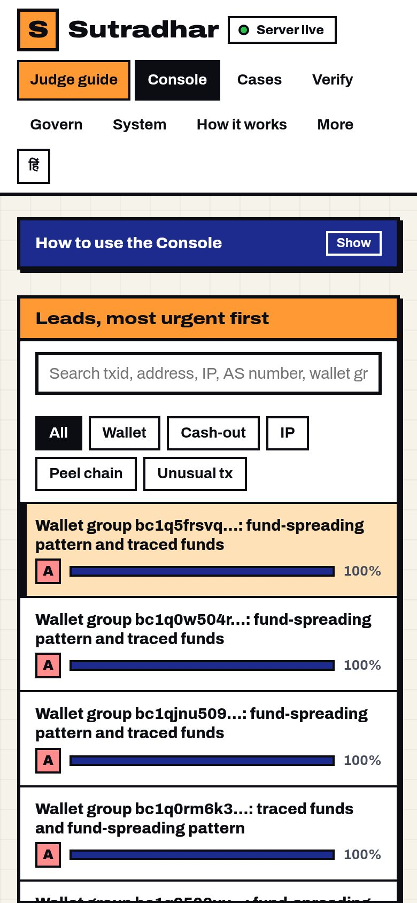</div>
</details>

---

## ✅ Every requirement, and where to check it

<details open>
<summary><b>20 of 20 live.</b> Each row links to code or a live page. The same board, with one-click links, is on the <a href="https://sutradhar-one-red.vercel.app">landing page</a>.</summary>

| # | PS asked for | What we built | Proof |
|---|---|---|---|
| 1 | Complete **offline** system | Runs with no network: the self-test passes inside `docker run --network none`; the compose stack has no route out. | [`ci.yml`](.github/workflows/ci.yml), [System page](https://sutradhar-one-red.vercel.app/#/system) |
| 2 | Ingest **CSV / JSON / XML** | Also TSV and NDJSON; identical normalised data in every format; XML entity attacks blocked; auto-mapper; rejects report. | [`test_formats.py`](packages/engine/tests/test_formats.py) |
| 3 | **Correlate** network with blockchain | Trained origin-IP model over sensor timing, joined to wallet clusters. | [`e09_origin.py`](packages/engine/sutradhar_engine/stages/e09_origin.py) |
| 4 | **AI/ML**: anomalies, clusters, ranked leads | Origin, change and CoinJoin models, calibrated LightGBM ranker, Isolation Forest, embeddings. | [`EVAL.md`](docs/EVAL.md) |
| 5 | Parse all fields | Exact integer satoshis, UTC microseconds, fee and script type inferred when absent. | [`data-contract.md`](docs/data-contract.md) |
| 6 | **Graph** of IPs, wallets, txs | Evidence-tagged edges: value flow, origin, co-origin, taint path. | [link graph](https://sutradhar-one-red.vercel.app/#/console?lead=bc1q5frsvq&tab=evidence) |
| 7 | **Working model, not just rules** | Four trained models plus Isolation Forest, each evaluated against a rule baseline on unseen worlds. | [How it works](https://sutradhar-one-red.vercel.app/#/how-it-works) |
| 8 | **Ranked, explainable alerts + confidence** | Calibrated score, grade, TreeSHAP reasons, counter-evidence, what-if, hedged summary. | [Why tab](https://sutradhar-one-red.vercel.app/#/console?lead=bc1q5frsvq&tab=why) |
| 9 | **Dashboard / link analysis** | Tabbed console, link graph, Sankey flows, replay, X-ray, pipeline view. | [live demo](https://sutradhar-one-red.vercel.app) |
| 10 | Focus: **entity clustering** | Common-input ownership with a CoinJoin guard, change-address model, graph embeddings, analyst-approved merges. | [`e05_cluster.py`](packages/engine/sutradhar_engine/stages/e05_cluster.py) |
| 11 | Focus: **anomaly detection** | Isolation Forest over value, fee rate and split shape. | [`e08_anomaly.py`](packages/engine/sutradhar_engine/stages/e08_anomaly.py) |
| 12 | Focus: **peeling chains / mixing** | Timing-aware peel-chain traversal; trained CoinJoin classifier. | [`e07_peel.py`](packages/engine/sutradhar_engine/stages/e07_peel.py), [`e04_coinjoin.py`](packages/engine/sutradhar_engine/stages/e04_coinjoin.py) |
| 13 | Focus: **risk propagation** | Haircut taint with hop decay, personalised PageRank, k-best paths. | [Path to seed](https://sutradhar-one-red.vercel.app/#/console?lead=bc1q9506uy&tab=path) |
| 14 | **Synthetic dataset** like real fields | UTXO economy, Bitcoin-style relay timing, sensors, ransomware, CoinJoin and darknet stories. | `sutradhar gen run` |
| 15 | Minimum dataset fields | The specified columns plus optional extras, in four formats. | [`DATASET.md`](docs/DATASET.md) |
| 16 | **Open-source GeoIP** | DB-IP Lite (CC BY 4.0) bundled; source, licence, date and checksum recorded. | [`manifest.json`](packages/engine/sutradhar_engine/refdata/manifest.json) |
| 17 | Offline solution for **Linux** | `docker compose -f compose.airgap.yaml up`. | [`compose.airgap.yaml`](compose.airgap.yaml) |
| 18 | Working prototype, **code repo** | This repository: CI, tests, import-boundary contracts, security gate. | [Actions](https://github.com/Abhishek222983101/sutradhar-btc/actions) |
| 19 | Short **technical write-up** | Approach, model choice, explainability, limits (PDF too). | [`TECHNICAL_WRITEUP.md`](docs/TECHNICAL_WRITEUP.md) |
| 20 | **Evidence per flag** | Reasons, candidate IPs, transactions, replay, and a sealed evidence pack per case. | [Cases](https://sutradhar-one-red.vercel.app/#/cases), [Verify](https://sutradhar-one-red.vercel.app/#/verify) |

</details>

---

## 📊 Results: the numbers, not just the claim

Every number is produced by a committed command against freshly generated worlds with hidden ground truth. Reproduce with
`uv run sutradhar evals report`; the full table is [`docs/EVAL.md`](docs/EVAL.md).

*Scenario `rich`, five unseen worlds, 2,038 observable transactions:*

| What | Result | Compared with |
|---|---|---|
| Origin IP found on the first try | **39.1%** | random guess **4.4%**, earliest-announcer rule **37.5%**, ceiling **67.8%** |
| Origin IP within the top 3 | **51.5%** | |
| Wallet cluster purity vs. hidden truth | **99.9%** | 99.5% if CoinJoins were merged |
| Lead ranker PR-AUC (with / without watchlist seeds) | **0.983 / 0.980** | taint alone: 0.963 / 0.013 |
| Calibration error (ECE) | **0.002** | a "90%" lead is right about nine times in ten |
| CoinJoin classifier precision / recall | **100% / 100%** | 30 mixes; the rule it replaced scores the same |
| Change output identified | **95.2%** | links used for clustering: 99.6% precise |

> **Read this honestly.** The origin model beats the classic earliest-announcer rule by under two points, and both sit near the
> ceiling the sensor placement allows (in a third of cases no sensor hears the origin). The value is the evidence, clustering,
> calibration and explanation built around the origin call. CoinJoin results are on our generator's mixes, whose look-alikes are
> easy negatives, so real-world recall will be lower.

---

## 🏗️ How it works

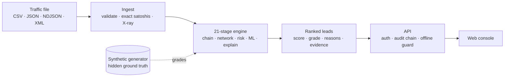

<div align="center">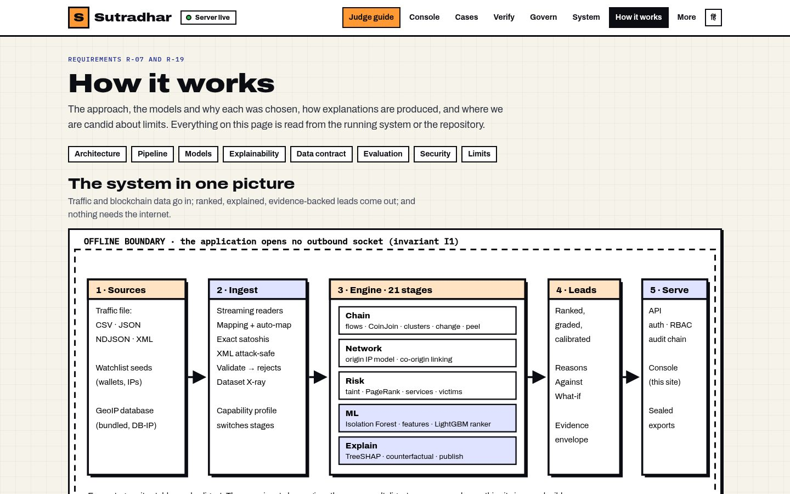</div>

* **Two immutable stores.** A dataset never changes after ingest and a finished run is read-only; the same input gives the same result digest.
* **Every claim carries evidence** (method, confidence, the transactions behind it) and a hedged, language-guarded summary: a lead is for review, never a verdict.
* **Models**, trained on generated worlds and tested on unseen ones, each against a rule baseline: LightGBM lead ranker with isotonic calibration, logistic origin-IP, change-address and CoinJoin classifiers, Isolation Forest for anomalies.
* **The generator** simulates a UTXO economy, Bitcoin-style relay timing, sensors, ransomware laundering, a CoinJoin service and a darknet market, deterministic from a seed.
* **Plugins.** Extra stages can be added from any Python package ([`docs/PLUGINS.md`](docs/PLUGINS.md)).

---

## 🔒 Proved offline

```bash
docker build -f deploy/api.Dockerfile -t sutradhar .
docker run --rm --network none sutradhar sutradhar selftest     # generate → ingest → analyse → verify, with no network
```

CI runs exactly this on every push. The application also refuses outbound sockets on its own, ships its GeoIP data and model
weights inside the bundle, and the compose stack puts the API on an internal network with no route out.

## 🛡️ Built to be trusted

| | |
|---|---|
| **Tests** | 500+ Python tests (unit, property-based, end-to-end API), web unit tests, and a real-browser run of the whole judge flow ([`e2e-judge-flow.mjs`](apps/web/scripts/e2e-judge-flow.mjs), 19 checks) plus a run that blocks the API and proves the site still renders ([`e2e-asleep-server.mjs`](apps/web/scripts/e2e-asleep-server.mjs)). |
| **CI gates** | Lint, format, import-boundary contracts (the engine can never read ground truth), the offline `--network none` self-test, security scans, and a check that fails the build if the web bundle references an external host. |
| **Tamper evidence** | Hash-chained audit log; evidence packs list every file's SHA-256 and carry an HMAC seal. |
| **Access control** | A permission matrix per role, declared on every route and tested; demo visitors are isolated from each other. |
| **Hostile input** | XML entity and billion-laughs attacks refused; uploads size-capped, validated row by row and deleted after an hour. |
| **Lawful use** | A language guard forbids wording that states identity or guilt; every lead carries counter-evidence; nothing merges without an audited analyst decision. |

---

## 💻 Run it yourself

```bash
git clone https://github.com/Abhishek222983101/sutradhar-btc.git && cd sutradhar-btc
uv sync                                                                  # Python 3.12 workspace
uv run sutradhar selftest                                                # end-to-end checks
uv run sutradhar gen run --scenario rich --seed 1 --out worlds/rich      # a synthetic world
uv run sutradhar evals report                                            # reproduce every number above
```

<details>
<summary><b>The full offline product (web + API + worker)</b> and your own data</summary>

```bash
export JWT_SECRET=$(openssl rand -hex 32)
docker compose -f compose.airgap.yaml up -d --build
docker compose -f compose.airgap.yaml exec api sutradhar users create --email you@example.org --name You --role lead
# open http://127.0.0.1:8080 and sign in
```

Files in the canonical layout load directly. Files with other column names: `uv run sutradhar ingest yourfile.csv --auto-map`
proposes and applies a mapping and prints every guess. See [`docs/README-AIRGAP.txt`](docs/README-AIRGAP.txt) for the
air-gapped install and `sutradhar gen --help` for the generator.

</details>

## 📁 Project structure

```
packages/schemas    the data contract: fields, units, evidence envelope
packages/engine     ingest + the 21 analysis stages + trained model weights + bundled GeoIP
packages/generator  synthetic Bitcoin worlds with hidden ground truth
packages/evals      training and evaluation against ground truth (the only code that reads truth)
packages/cli        the `sutradhar` command
apps/api            FastAPI: auth, audit log, job queue, offline guard, sealed exports
apps/web            the console and Judge guide (React 19, Vite)
deploy/             Dockerfiles, compose, Caddy
docs/               write-up, evaluation, demo script, data contract, screenshots
```

## 📚 Documentation

| Doc | What's in it |
|---|---|
| [**DEMO_SCRIPT.md**](docs/DEMO_SCRIPT.md) | The video script, a page-by-page test checklist, and a plain-language explainer of every term |
| [**TECHNICAL_WRITEUP.md**](docs/TECHNICAL_WRITEUP.md) | Approach, model choice, explainability method, limits |
| [**EVAL.md**](docs/EVAL.md) | Every metric, per seed, reproducible |
| [**DATASET.md**](docs/DATASET.md) | The dataset fields and generated scenarios |
| [**data-contract.md**](docs/data-contract.md) | Field-level contract and JSON Schemas |
| [**INVARIANTS.md**](docs/INVARIANTS.md) | The rules every change must keep, each with its test |
| [**SECURITY_PASS.md**](docs/SECURITY_PASS.md) | Threats considered and the test that pins each |
| [**BUILD_LOG.md**](docs/BUILD_LOG.md) | Every sub-phase of the build plan and its status, including what was cut |

## 🛠️ Tech stack

              

## ⚠️ Honest limits

All data is synthetic. The origin model is only a few points better than the classic rule. The CoinJoin classifier matches rather
than beats the rule it replaced on generated mixes. We cut a red-team report, a retrain-and-promote loop and three stretch
comparisons for time (see [`BUILD_LOG.md`](docs/BUILD_LOG.md)). Hindi covers navigation and titles only. The free demo host runs
one worker, so concurrent uploads queue and an analysis takes one to two minutes.

---

## 👥 Team Paradigm

Built end-to-end for **Smart India Hackathon 2026 · PS 26146**.

## 📄 License and attributions

Apache 2.0 (see [`LICENSE`](LICENSE)). IP geolocation data: **DB-IP Lite**, CC BY 4.0, https://db-ip.com. All Bitcoin data in
this repository is synthetic; no real traffic or seized data is included.
